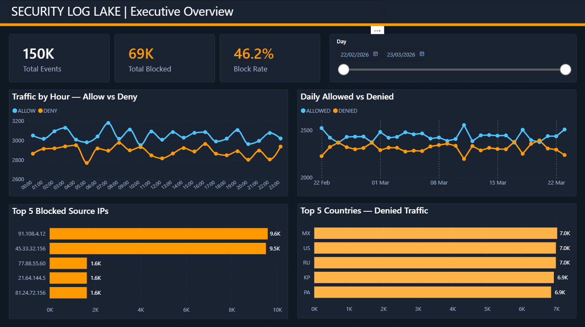
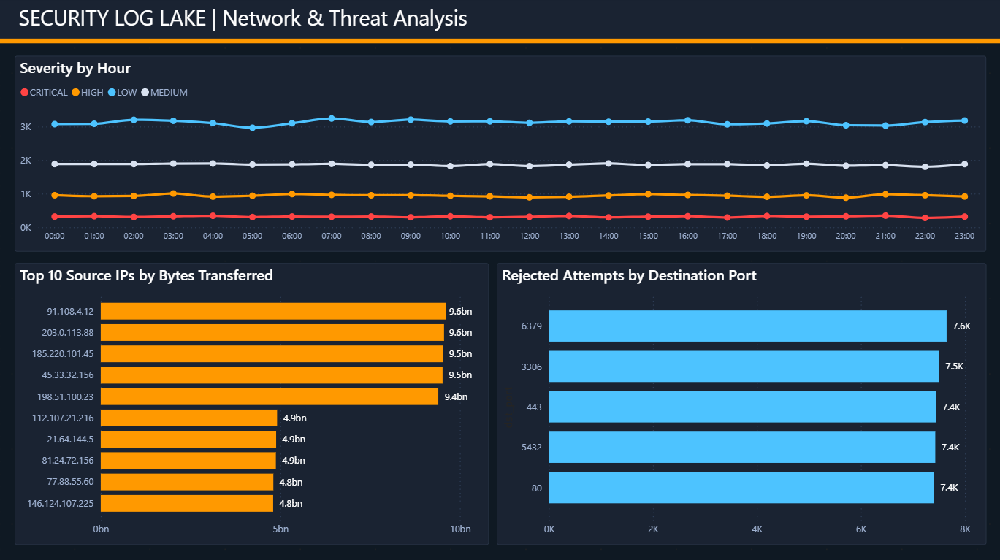
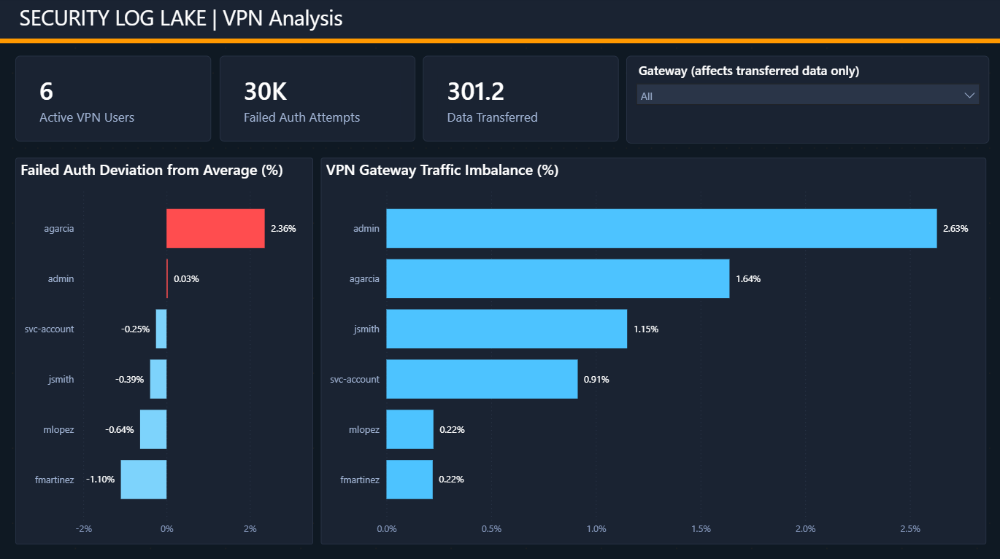

[English](README.md) | Español

# 🔐 Security Log Lake & Traffic Insights en AWS

> **Plataforma serverless de analítica para telemetría de seguridad y red** — recibe logs crudos de firewall, VPN y VPC Flow, los normaliza a través de un pipeline automatizado, y genera insights accionables mediante SQL y dashboards interactivos en Power BI.

<br>

## 📊 Dashboards

### Vista Ejecutiva

*150K eventos totales en 30 días · 69K bloqueados · 46.2% de tasa de bloqueo · slicer de fecha interactivo*

### Análisis de Red y Amenazas

*Mapa de calor de severidad por hora · Top 10 IPs por bytes · Puertos más rechazados*

### Análisis VPN

*6 usuarios activos · 30K intentos de autenticación fallidos · desbalance de gateway · desviación del promedio*

<br>

## 📌 Descripción del Proyecto

Este proyecto simula un **pipeline de datos para un Centro de Operaciones de Seguridad (SOC)** construido íntegramente sobre servicios serverless de AWS. Cubre el ciclo completo de la telemetría de seguridad: desde la generación de logs crudos, pasando por su normalización automática, hasta el análisis SQL y dashboards ejecutivos en Power BI.

Diseñado como **proyecto de portafolio real**, demuestra habilidades de ingeniería cloud, ingeniería de datos y analítica de seguridad en un entorno colaborativo con control de versiones.

<br>

## 🏗️ Arquitectura

```
Logs Sintéticos
      │
      ▼
 S3 (raw/)           ← Particionado por fuente: firewall/, vpn/, vpc-flow/
      │
      │  S3 Event Notification (ObjectCreated)
      ▼
 AWS Lambda           ← Python 3.12 | Normaliza timestamps, IPs, puertos, acciones
 (security-log-lake-parser)
      │
      ▼
 S3 (processed/)      ← CSVs limpios y enriquecidos listos para consulta
      │
      ▼
 Amazon Athena         ← SQL serverless sobre S3 | 9 queries analíticos
      │
      ▼
 Dashboards Power BI   ← Vista Ejecutiva · Red y Amenazas · Análisis VPN
```

<br>

## ☁️ Servicios AWS Utilizados

| Servicio | Rol |
|---|---|
| **Amazon S3** | Almacenamiento de logs crudos y procesados, particionados por fuente y fecha |
| **AWS Lambda** | Parser event-driven — normaliza, valida y enriquece los logs |
| **Amazon Athena** | SQL serverless directamente sobre S3 (sin base de datos que administrar) |
| **AWS IAM** | Roles y políticas de mínimo privilegio para Lambda y Athena |
| **Amazon CloudWatch** | Monitoreo de ejecución de Lambda, logging de errores y alertas |
| **S3 Event Notifications** | Trigger event-driven: nuevo archivo crudo → invocación automática de Lambda |

<br>

## 📦 Pipeline de Datos — Cómo Funciona

### 1. Generación de Logs (`ingestion/generate_logs.py`)
Genera **3 tipos de logs de seguridad sintéticos** durante **30 días** a **5,000 registros/día por fuente** — 450,000 registros en total:

| Tipo de Log | Campos | Descripción |
|---|---|---|
| **Firewall** | 15 campos | Acción, IPs, puertos, protocolo, bytes, severidad, país |
| **VPN** | 11 campos | Eventos de autenticación, usuario, gateway, duración de sesión, estado |
| **VPC Flow** | 12 campos | Registros de flujo de red estilo AWS con conteos de paquetes y bytes |

Incluye **simulación realista de amenazas**: un conjunto de IPs maliciosas conocidas aparece con tasas de DENY ponderadas para simular patrones reales de tráfico atacante.

### 2. Lambda Parser (`lambda/parser/handler.py`)
Función Python 3.12 disparada automáticamente en cada subida a S3. Realiza:
- **Detección** del tipo de log desde el prefijo de la key en S3
- **Validación** de cada campo contra el schema de su fuente, registrando problemas sin descartar registros
- **Normalización** de timestamps a formato ISO 8601 desde múltiples formatos de entrada
- **Estandarización** de vocabularios de acción y estado (`ACCEPT` → `ALLOW`, `AUTH_FAIL` → `FAIL`, `REJECT` → `DENY`)
- **Enriquecimiento** de cada registro con metadata: `_source`, `_processed_at`, `_has_issues`
- **Escritura** de CSVs limpios en `processed/` para consumo de Athena

### 3. Analítica con Athena (`athena/queries/`)
Tablas externas definidas directamente sobre S3 — sin ETL, sin infraestructura que aprovisionar. Nueve queries analíticos:

| Query | Insight |
|---|---|
| **Q1** | Top 10 IPs con más tráfico bloqueado |
| **Q2** | Tráfico permitido vs. bloqueado por hora |
| **Q3** | Top talkers por bytes totales transferidos |
| **Q4** | Intentos de autenticación VPN fallidos por usuario |
| **Q5** | Duración de sesiones VPN y bytes por usuario/gateway |
| **Q6** | Tráfico VPC rechazado por puerto de destino |
| **Q7** | Distribución de severidad de firewall por hora |
| **Q8** | Países con más tráfico denegado |
| **Q9** | Resumen ejecutivo diario — eventos, bloqueos, resets, bytes |

### 4. Dashboards Power BI
Tres páginas conectadas a los nueve CSVs resultado de Athena:

| Página | Visualizaciones Clave |
|---|---|
| **Vista Ejecutiva** | KPIs, tendencias de tráfico por hora, IPs más bloqueadas, países denegados |
| **Red y Análisis de Amenazas** | Gráfico de severidad por hora, top talkers por bytes, puertos rechazados |
| **Análisis VPN** | Desviación de auth fallida del promedio, desbalance de gateway, datos de sesión |

<br>

## 📁 Estructura del Repositorio

```
security-log-lake-aws/
│
├── ingestion/
│   ├── generate_logs.py          # Generador de logs sintéticos (firewall, VPN, VPC Flow)
│   └── sample-logs/              # Archivos CSV generados (en .gitignore)
│
├── lambda/
│   └── parser/
│       ├── handler.py            # Función Lambda — lógica central de normalización
│       ├── requirements.txt      # Dependencias (boto3 preinstalado en Lambda)
│       ├── trust-policy.json     # IAM trust policy para el rol de ejecución de Lambda
│       └── s3-notification.json  # Configuración del trigger de eventos S3
│
├── athena/
│   └── queries/
│       ├── 01_create_tables.sql  # DDL de tablas externas para los 3 tipos de log
│       └── 02_analytics.sql      # 9 queries analíticos (Q1–Q9)
│
├── powerbi/
│   └── data/                     # CSVs resultado de Athena para Power BI (q1–q9)
│
├── docs/
│   └── screenshots/              # Capturas de los dashboards
│
├── .gitignore
├── LICENSE
├── README.md
└── README.es.md
```

<br>

## 🔧 Aspectos Técnicos Destacados

- **Arquitectura Event-Driven** — Lambda se dispara en `s3:ObjectCreated:*`, sin polling
- **Validación de Schema en Ingesta** — cada campo validado por fuente; problemas registrados sin descartar registros
- **Capa de Normalización Unificada** — vocabularios heterogéneos entre tipos de log resueltos en escritura, manteniendo los queries de Athena limpios
- **SQL Serverless** — Athena consulta S3 directamente mediante tablas externas; sin aprovisionamiento de base de datos
- **Pipeline Idempotente** — re-subir un archivo crudo sobreescribe el resultado procesado sin efectos secundarios
- **Metadata de Calidad de Datos** — cada registro procesado incluye `_has_issues` y `_processed_at` para trazabilidad completa
- **IAM de Mínimo Privilegio** — rol de ejecución de Lambda limitado a recursos específicos

<br>

## 📈 Hallazgos Clave de 30 Días de Datos

| Métrica | Valor |
|---|---|
| Total de eventos de firewall | 150,000 |
| Tasa de bloqueo global | 46.2% |
| IP más bloqueada | `91.108.4.12` — 9,586 conexiones bloqueadas |
| País con más tráfico denegado | MX — 7,028 eventos |
| Puerto más atacado | 6379 (Redis) — 7,648 rechazos en VPC |
| Líder en fuerza bruta VPN | `agarcia` — 5,097 intentos fallidos (+2.36% sobre el promedio) |
| Total de auth VPN fallidas | 30K entre todos los usuarios |
| Mayor consumidor de ancho de banda | `91.108.4.12` — 9.6 mil millones de bytes |

<br>

## 🚀 Cómo Reproducir el Proyecto

### Prerrequisitos
- Cuenta AWS con acceso a S3, Lambda, Athena, IAM, CloudWatch
- Python 3.10+
- AWS CLI configurado (`aws configure`)
- Power BI Desktop

### 1. Clonar el repositorio
```bash
git clone https://github.com/angel-wm/security-log-lake-aws.git
cd security-log-lake-aws
```

### 2. Generar logs sintéticos
```bash
python ingestion/generate_logs.py
# Genera 90 archivos CSV (30 días × 3 fuentes) en ingestion/sample-logs/
```

### 3. Subir logs a S3
```bash
aws s3 cp ingestion/sample-logs/ s3://TU-BUCKET/raw/firewall/ --recursive --exclude "*" --include "firewall_*.csv"
aws s3 cp ingestion/sample-logs/ s3://TU-BUCKET/raw/vpn/ --recursive --exclude "*" --include "vpn_*.csv"
aws s3 cp ingestion/sample-logs/ s3://TU-BUCKET/raw/vpc-flow/ --recursive --exclude "*" --include "vpc-flow_*.csv"
```

### 4. Desplegar el parser Lambda
```bash
cd lambda/parser
zip function.zip handler.py
aws lambda update-function-code \
  --function-name security-log-lake-parser \
  --zip-file fileb://function.zip
```

### 5. Configurar el trigger S3
```bash
aws s3api put-bucket-notification-configuration \
  --bucket TU-BUCKET \
  --notification-configuration file://lambda/parser/s3-notification.json
```

### 6. Ejecutar analítica en Athena
Correr `athena/queries/01_create_tables.sql` y luego `02_analytics.sql` en la consola de Athena.

### 7. Abrir Power BI
Conectar Power BI Desktop a los CSVs en `powerbi/data/`.

> Guía completa de despliegue disponible en [docs/setup.md](docs/setup.md)

<br>

## 👥 Equipo

Construido de extremo a extremo por dos ingenieros en un flujo colaborativo basado en PRs — ambos contribuyeron con commits visibles en todas las fases del proyecto.

| | [flaviobox](https://github.com/flaviobox) | [angel-wm](https://github.com/angel-wm) |
|---|---|---|
| Infraestructura Cloud & IAM | ✅ | ✅ |
| Arquitectura S3 & Modelado de Datos | ✅ | ✅ |
| Parser Python (Lambda) | ✅ | ✅ |
| Analítica SQL con Athena | ✅ | ✅ |
| Dashboards Power BI | ✅ | ✅ |
| **Dominio Principal** | Python, SQL & Analytics | Cloud Infrastructure & Security |

> Ambos participaron en todas las fases. "Dominio Principal" refleja dónde cada uno aportó mayor expertise previo — no propiedad exclusiva de ningún entregable.

**Estrategia de ramas**: `main` ← PR desde `dev-angel` / `dev-flavio` — todos los merges pasan por pull requests para un historial de contribuciones trazable y auditable.

<br>

## 🧠 Decisiones Técnicas Clave

- **Tablas externas de Athena en lugar de Glue Crawlers** — mayor control del schema, iteración más rápida y sin complejidad de scheduling
- **CSV en lugar de Parquet para archivos procesados** — conectividad directa con Power BI sin transformación adicional; Parquet es la optimización natural a mayor escala
- **Normalización en Lambda, no en VIEWs de Athena** — schemas limpios en escritura reducen costo de transformación repetida y eliminan bugs en tiempo de query
- **`_has_issues` como STRING, no BOOLEAN** — el lector CSV de Athena no parsea valores booleanos de archivos de texto de forma confiable; STRING evita NULLs silenciosos
- **Status de VPN normalizado a mayúsculas en ingesta** — Athena hace matching exacto de strings; normalizar en Lambda previene errores en tiempo de query

<br>

## 🛣️ Roadmap

- [x] Generador de logs sintéticos (firewall, VPN, VPC Flow)
- [x] Bucket S3 con estructura `raw/`, `processed/`, `curated/`, `athena-results/`
- [x] Parser Lambda con validación de schema y normalización
- [x] Trigger event-driven en S3
- [x] Tablas externas en Athena y 9 queries analíticos
- [x] Power BI — Dashboard Vista Ejecutiva
- [x] Power BI — Dashboard Red & Análisis de Amenazas
- [x] Power BI — Dashboard Análisis VPN
- [x] `docs/setup.md` — guía completa de despliegue
- [x] `docs/data-dictionary.md` — definiciones de campos y enumeraciones
- [ ] Tablas de Athena particionadas por fecha para optimización de costos
- [ ] Output en Parquet vía Lambda o Glue para rendimiento a escala de producción

<br>

## 📄 Licencia

[MIT](LICENSE) — libre de usar, aprender y construir sobre este proyecto.

<br>

---

> *Construido para demostrar habilidades reales de ingeniería de datos en la nube y analítica de seguridad — no solo teoría, sino un pipeline funcional desde bytes crudos hasta insight de negocio.*