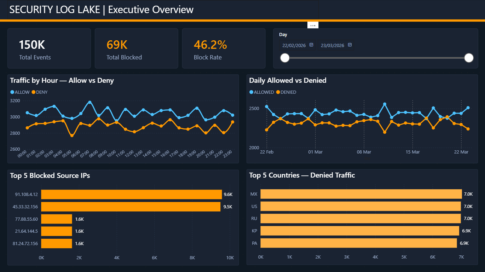
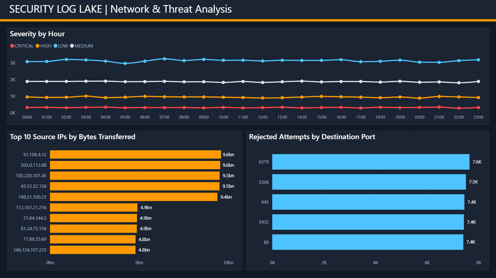
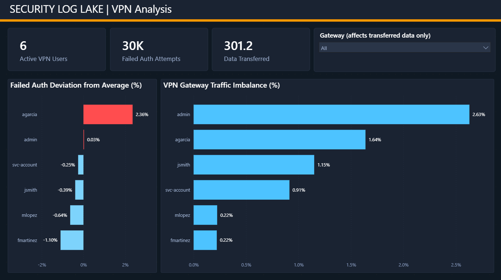

[English](README.md) | Español

# Security Log Lake & Traffic Insights en AWS

Security Log Lake es un pipeline serverless de analítica de seguridad para telemetría sintética de firewall, VPN y VPC Flow. Genera logs crudos, los normaliza con una función AWS Lambda orientada a eventos, consulta los datos procesados con Amazon Athena y presenta el análisis resultante en Power BI.

El repositorio es un proyecto de portafolio construido por dos ingenieros para demostrar ingeniería de datos en la nube, analítica de seguridad, SQL, Python, Power BI y un flujo colaborativo basado en Pull Requests.

## Empieza aquí

Este proyecto resulta especialmente útil si quieres inspeccionar o reproducir:

- un flujo orientado a eventos S3 → Lambda → S3;
- normalización consciente del esquema para tres fuentes de logs de seguridad;
- analítica SQL serverless en Athena;
- una capa de reporting en Power BI basada en CSVs de resultados de Athena;
- despliegue, esquemas, hallazgos y decisiones técnicas documentadas.

### Requisitos y limitaciones importantes

Para reproducir el proyecto necesitas:

- una cuenta AWS con acceso a S3, Lambda, Athena, IAM y CloudWatch;
- Python 3.10+ para generar logs localmente;
- AWS CLI v2 configurado con tus credenciales;
- Power BI Desktop en Windows para el flujo de dashboards.

Antes de reutilizar la configuración AWS, reemplaza los valores específicos del despliegue original en:

- `lambda/parser/s3-notification.json` — contiene el ARN original de la función Lambda;
- `athena/queries/01_create_tables.sql` — contiene el bucket original del proyecto en las cláusulas `LOCATION`.

La guía de despliegue usa actualmente la política administrada `AmazonS3FullAccess` para facilitar la reproducción. Debe entenderse como una configuración de laboratorio/portafolio, no como una línea base de mínimo privilegio para producción.

El generador sintético no fija una semilla aleatoria. Si regeneras los 30 días de datos, los conteos y hallazgos serán distintos a los del run publicado en el repositorio.

Para el flujo completo de despliegue y las sustituciones necesarias, consulta la [Guía de Setup](docs/setup.md).

## Inicio rápido

1. Clona el repositorio.

   ```bash
   git clone https://github.com/angel-wm/security-log-lake-aws.git
   cd security-log-lake-aws
   ```

2. Genera el dataset sintético local.

   ```bash
   python ingestion/generate_logs.py
   ```

   El generador crea 90 archivos CSV: 30 días × 3 fuentes × 5,000 registros por fuente/día, para un total de 450,000 registros.

3. Sigue la [Guía de Setup](docs/setup.md) para crear los prefijos S3, desplegar el parser Lambda, configurar el trigger S3 y sustituir tus identificadores AWS.

4. Ejecuta `athena/queries/01_create_tables.sql` y después Q1–Q9 desde `athena/queries/02_analytics.sql`.

5. Usa los CSVs resultantes en `powerbi/data/` para actualizar la capa de reporting en Power BI.

Si Lambda no procesa los archivos cargados o falla algún paso del despliegue, consulta la [sección de troubleshooting](docs/setup.md#10-troubleshooting).

## Arquitectura

El pipeline tiene un flujo principal:

```text
Generador de logs sintéticos
        |
        v
S3 raw/<fuente>/
        |
        | s3:ObjectCreated:*
        v
AWS Lambda: security-log-lake-parser
        |
        | validar + normalizar + enriquecer
        v
S3 processed/<fuente>/
        |
        v
Tablas externas en Amazon Athena
        |
        | CSVs resultado de Q1-Q9
        v
Dashboards Power BI
```

El comportamiento esencial también puede verificarse directamente en el código:

| Componente | Fuente de verdad | Responsabilidad |
| --- | --- | --- |
| Datos sintéticos | [`ingestion/generate_logs.py`](ingestion/generate_logs.py) | Genera CSVs de firewall, VPN y VPC Flow |
| Normalización | [`lambda/parser/handler.py`](lambda/parser/handler.py) | Detecta fuente, valida campos, normaliza valores, agrega metadata y escribe CSVs procesados |
| Trigger de eventos | [`lambda/parser/s3-notification.json`](lambda/parser/s3-notification.json) | Invoca Lambda para objetos CSV creados bajo `raw/` |
| Esquema Athena | [`athena/queries/01_create_tables.sql`](athena/queries/01_create_tables.sql) | Define las tres tablas externas |
| Analítica | [`athena/queries/02_analytics.sql`](athena/queries/02_analytics.sql) | Implementa nueve queries analíticos |
| Datos de reporting | [`powerbi/data/`](powerbi/data/) | Conserva los CSVs resultado de Athena usados por Power BI |

## Pipeline de datos

### Generación de logs sintéticos

`ingestion/generate_logs.py` crea tres fuentes durante 30 días a 5,000 registros por fuente/día.

| Fuente | Campos crudos | Ejemplos de comportamiento modelado |
| --- | ---: | --- |
| Firewall | 15 | acciones, IPs, puertos, protocolo, bytes, severidad, política, países |
| VPN | 11 | autenticación, usuarios, gateways, duración de sesión, volumen transferido, motivo de fallo |
| VPC Flow | 12 | interfaces, IPs, puertos, números de protocolo, paquetes, bytes, acción de flujo |

El generador pondera un conjunto fijo de IPs de origen hacia tráfico bloqueado para crear patrones de amenaza consistentes a nivel de escenario, aunque las filas generadas individualmente siguen siendo estocásticas.

### Normalización en Lambda

La función Lambda en Python 3.12:

- detecta `firewall`, `vpn` o `vpc-flow` desde el prefijo de la key S3;
- revisa cada fila en busca de campos requeridos y registra los problemas detectados;
- normaliza timestamps a ISO 8601;
- reduce vocabularios heterogéneos de acción/estado a un conjunto más pequeño;
- agrega `_source`, `_processed_at` y `_has_issues`;
- escribe el CSV procesado en el prefijo `processed/<fuente>/` correspondiente.

El DDL actual de Athena declara `_has_issues` como `BOOLEAN`; el CSV contiene los valores serializados `True` y `False`.

### Analítica con Athena

El repositorio contiene nueve queries analíticos:

| Query | Insight |
| --- | --- |
| Q1 | IPs de origen más bloqueadas |
| Q2 | Tráfico permitido vs. bloqueado por hora |
| Q3 | Top talkers por bytes totales |
| Q4 | Fallos de autenticación VPN por usuario |
| Q5 | Duración y bytes de sesiones VPN por usuario/gateway |
| Q6 | Tráfico VPC rechazado por puerto de destino |
| Q7 | Distribución de severidad de firewall por hora |
| Q8 | Países con más tráfico denegado |
| Q9 | Resumen ejecutivo diario |

Como la capa Lambda convierte `DROP` de firewall en `DENY`, la columna `dropped` de Q9 es `0` para el dataset procesado actual.

## Evidencia visual

Las siguientes capturas corresponden al run de reporting publicado. Los CSVs subyacentes están versionados en `powerbi/data/`.

### Vista Ejecutiva



La vista ejecutiva resume 150,000 eventos de firewall en 30 días, tráfico bloqueado, patrones horarios, IPs más bloqueadas y tráfico denegado por país.

### Análisis de Red y Amenazas



La página de red combina severidad por hora, IPs de alto volumen y puertos VPC de destino rechazados.

### Análisis VPN



La página VPN compara autenticaciones fallidas por usuario, actividad de sesiones, tráfico por gateway y desviación frente al promedio.

## Hallazgos publicados

Estos valores provienen de los CSVs de Athena versionados en `powerbi/data/`. Un dataset regenerado producirá resultados distintos porque el generador es estocástico.

| Métrica | Resultado publicado |
| --- | ---: |
| Eventos de firewall | 150,000 |
| Eventos de firewall bloqueados | 69,295 |
| Tasa de bloqueo global | 46.2% |
| IP de origen más bloqueada | `91.108.4.12` — 9,586 |
| País de origen con más denegaciones | MX — 7,028 |
| Puerto VPC de destino más rechazado | 6379 — 7,648 |
| Eventos de autenticación VPN fallidos | 29,878 |
| Usuario con más fallos de autenticación | `agarcia` — 5,097 |
| IP de origen con mayor volumen | `91.108.4.12` — 9,606,409,766 bytes |

## Mapa de documentación

Elige según lo que necesites hacer:

| Objetivo | Documento |
| --- | --- |
| Desplegar o reproducir el proyecto | [Guía de Setup](docs/setup.md) |
| Consultar campos raw, processed, Athena, salidas o medidas DAX | [Diccionario de Datos](docs/data-dictionary.md) |
| Revisar el comportamiento del generador | [Generador de logs](ingestion/generate_logs.py) |
| Revisar validación y normalización | [Parser Lambda](lambda/parser/handler.py) |
| Revisar las tablas externas | [DDL de Athena](athena/queries/01_create_tables.sql) |
| Revisar la lógica analítica | [Queries de Athena](athena/queries/02_analytics.sql) |
| Revisar evidencia de dashboards | [Capturas](docs/screenshots/) |

## Estructura del repositorio

```text
security-log-lake-aws/
├── ingestion/
│   └── generate_logs.py
├── lambda/
│   └── parser/
│       ├── handler.py
│       ├── requirements.txt
│       ├── trust-policy.json
│       └── s3-notification.json
├── athena/
│   └── queries/
│       ├── 01_create_tables.sql
│       └── 02_analytics.sql
├── powerbi/
│   └── data/
├── docs/
│   ├── setup.md
│   ├── data-dictionary.md
│   └── screenshots/
├── README.md
└── README.es.md
```

## Decisiones técnicas y tradeoffs

- **Tablas externas de Athena en vez de un servidor de base de datos:** los CSVs procesados permanecen en S3 y se consultan en sitio.
- **DDL explícito en vez de Glue Crawlers:** el esquema queda visible y versionado.
- **CSV en vez de Parquet:** el flujo actual de portafolio prioriza archivos transparentes y uso directo en Power BI; Parquet queda como optimización futura.
- **Normalización en Lambda:** el vocabulario de acción/estado se estandariza una sola vez antes de la analítica.
- **Metadata de issues por fila:** `_has_issues` mantiene visibilidad sobre campos requeridos faltantes.
- **La configuración de despliegue no es totalmente portable tal como está versionada:** el bucket S3 original y el ARN de Lambda deben reemplazarse antes de reproducir el entorno.
- **IAM de la guía prioriza reproducibilidad:** la política S3 de acceso completo documentada debe reducirse en producción.

## Equipo y flujo de trabajo

Construido de extremo a extremo por dos ingenieros. Ambos participaron en el proyecto; el dominio principal indica mayor experiencia previa y no propiedad exclusiva.

| Colaborador | Dominio principal |
| --- | --- |
| [flaviobox](https://github.com/flaviobox) | Python, SQL y analítica |
| [angel-wm](https://github.com/angel-wm) | Infraestructura cloud y seguridad |

El proyecto utilizó las ramas `dev-angel` y `dev-flavio` con Pull Requests hacia `main`.

## Roadmap

Completado:

- generación sintética de firewall, VPN y VPC Flow;
- arquitectura S3 raw/processed;
- normalización Lambda y trigger orientado a eventos;
- tablas externas de Athena y analítica Q1–Q9;
- tres páginas de dashboard en Power BI;
- documentación de despliegue y diccionario de datos.

Optimizaciones futuras:

- particionar tablas Athena por fecha;
- emitir Parquet mediante Lambda o Glue para cargas de mayor escala.

## Licencia

[MIT](LICENSE) — libre para usar, aprender y construir sobre este proyecto.
